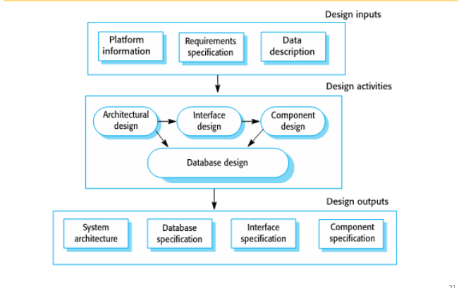
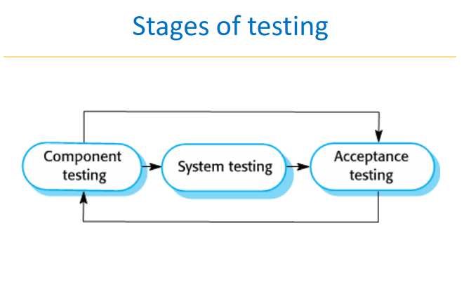
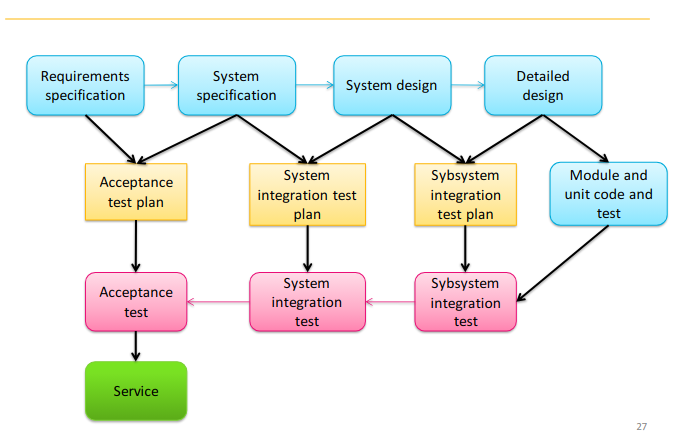
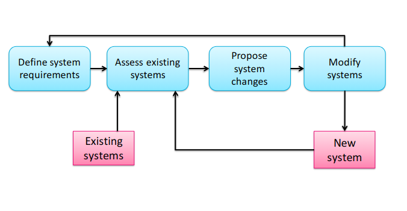
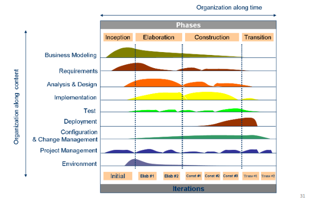

# Week 3

## 1. The Software Process

A structured set of activities required to develop a software system

### Specification (What the system should do?)

Software requirement, functional, non-functional reqs.

### Design & Implementation (How?)

It is how we should be able to implement the specifications in what the system should do.

#### How should we organize software?

The software organization is depedent on the developer's perspective. For example, in OOP software is a cluster of objects bounded together, the objects themselves are organized into subsystems. Or we can look at the software in a mathematical sense, and the program is a math solution created by various math functions.

### Validation

The process of determining if what we made in the design and implementation phase is correct to the specification.

_Some times the implementation is correct but in practice, the program is unusable._

**We must verify the customers expectations.**

We can usually do this via testing (Executable).

Executable is having dynamic state, being able to change variables.

### Summary

The software process model is the abstraction representation of a process.

### 2. Software Process Descriptions

- The activities in the process: specifying a data model, designing a user interface, etc.
- The ordering of these activities.
- Products (artifacts) : Outcomes of activities.
- Roles : The responsibility of the people.
- Pre and postconditions of the activity.
- Other meta-concepts to describe the process model.

### 3. Plan-driven and agile processses

Plan-driven processes:

- Activites are planned in advance.
- Process is measured against this plan.
  
Agile processes:

- Activites are incremental.
- Easier to change the process to reflect changing customer specifications.
  
Most practical processes include both agile and plan-driven approaches.

There is no right or wrong software processes.

### 4. Generic software process models

The waterfall model (plan-driven)

- Seperate and distinct phases of specification annd development.

Incremental development(plan-driven & agile)

- Specification, development and validation are interleaved.

Integration and configuration (plan-driven & agile)

- There are many variants of these models.

### 5. Waterfall model problems

- Difficult to respond to changing customers as of it's partitioning of the project into distinct stages.

- Only appropriate when the requirements are well-understood and there won't be much changing in the developing process.

### 6. Incremental development

#### Exploratory development

##### Work with customers to better understand the requirements

- Start with well-understood requirements.
- Add functions along the way according to the customers specification.

##### Throwaway prototyping

- Start with poorly understood requirements so the customers can clarify what they want.

### 7. Incremental development benefits

- The cost of acommodating customers changes are reduced.
- Easier to get customer feedback.
- More rapid delivery and deployment of useful software to the customer.

### 8. Incremental development problems

- Lack of process visibility.
- Lack of systematic structures.
- Require special skills (Eg. rapid prototyping languages).
- Applicability

### 9. Integration and configuration (component-based SE)

- Based on systematic reuse
  - Systems are integrated from existing components.
- Process stages:
  - Component analysis
  - Requirements modification
  - System design with reuse
  - Development and integration
- This approach is becoming increasingly used by component standards have emerged.

### 10. Types of reusable software

- Stand-alone application systems
- Collections of objects (as a package): integrated with a component framework such as dotnet or J2EE, .jar
- Web services

### 11. Advantages and disadvantages of reused focused software

- Reduced costs and risks as less software is developed from scratch.
- Faster delivery and deployment of system.
- Requirements compromises are inevitable so system may not meet real needs of users.
- Loss of control over evolution of reused system elements.

### 12. The requirements of the engineering process

### 13. Software specification

- The process of establishing what services are required and the constraints on the system

### 14. Software design and implementation

- The process of converting the system specification into an executable.
- Software design
  - Design a software structure that realises the specification.
- Implementation.

### 15. A General model of the design process

### 16. System implementation

Low code, no code

### 17. Software validation

- Verification and validation.
- Test cases. (ca kiem thu)
- User cases. (ca su dung)
- Test suite. (bo kiem thu)
  
#### Stages of testing

##### Testing stages

- Component or unit testing
- System testing
  - Testing of the system as a whole.
  - Checking emergent properties (proofing).
- Acceptance testing

##### Testing phasess in a plan-driven process

### 18. Software evolution

- Software is inheriently flexible and can change.
- As requirements change so does the software.

#### System evolution

### 19. The Rational Unified Process

**A modern process model derived from the work on the UML**

Normally described from 3 POV's

- A Dynamic perspective that shows phases over time
- A Static perspective that show process activities
- A practice perspective that suggessts good practice

#### RUP Phase model

#### RUP good practices

- Develop iteratively
- Manage requirements
- Component-based architectue
- Visually model software
- Verify software quality
- Control changes to software

### 20. Computer-aided software engineering

- Computer-aided software engineer or CASE is software developed to support developing software
- Activity automation
  - Graphical editors
  - Data dictionary to manage design entitles
  - GUI Builders for user interface construction
  - Debuggers to support program fault finding
  - Automated translators to generate new versions of a program

### Reminders

- _Reminder of 5 minute mini-test_
